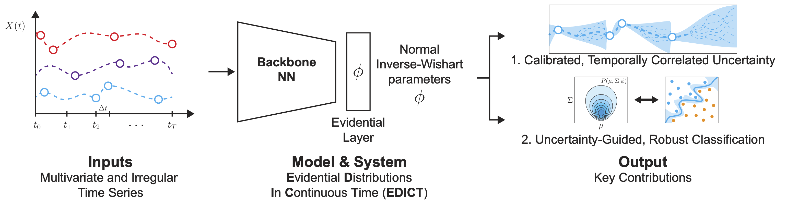

# Evidential Distributions in Continuous Time



Prevalent in many real-world settings such as healthcare, irregular time series are challenging to formulate predictions from. It is difficult to infer the value of a feature at any given time when observations are sporadic, as it could take on a range of values depending on when it was last observed. To characterize this uncertainty we present EDICT, a strategy that learns an evidential distribution over irregular time series in continuous time. This distribution enables well-calibrated and flexible inference of partially observed features at any time of interest, while expanding uncertainty temporally for sparse, irregular observations.

In this repository, we provide example code for constructing these multivariate evidential distributions in continuous time for synthetic data. The overall approach is presented in the paper ["Continuous Time Evidential Distributions for Irregular Time Series"](https://arxiv.org/abs/2307.13503) which is currently under review, but was included in the [2023 ICML Workshop on Interpretable Machine Learning in Healthcare](https://sites.google.com/view/imlh2023/home). 

## Paper
If you use this code in your research please cite the following:
```
@article{killian2023continuous,
  title={Continuous Time Evidential Distributions for Irregular Time Series},
  author={Killian, Taylor W and Zhang, Haoran and Hartvigsen, Thomas and Amini, Ava P},
  journal={arXiv preprint arXiv:2307.13503},
  year={2023}
}
```

This paper can also be found on arXiv at [2307.13503](https://arxiv.org/abs/2307.13503).

-----
[LICENSE](https://github.com/twkillian/EDICT/blob/master/LICENSE)

-----

### Use of this code 

Our goal in publishing this code is to facilitate deeper understanding of our work in hopes of motivating further research utilizing evidential distributions in complex sequential settings. 

### Project data 

The code in this repository uses a generated synthetic dataset automatically the first time the main file is executed. 

## Requirements

We recommend using the [Anaconda](https://docs.anaconda.com/anaconda/install/) distribution for python dependencies. The code should work will any recent version. In addition, the following packages are required:

- Pytorch (https://pytorch.org/) -> All recent versions should work.
- tqdm (`pip install tqdm`) -> All recent versions should work.
- torchdiffeq (`pip install torchdiffeq`) -> All versions should work. 

## How to use

The example contained in this repository is put together to provide general insight into how we set-up and train multivariate evidential distributions in continuous time. As such, it is constrained to only reproduce the results seen on the synthetic irregular time series experiments presented in the paper. This synthetic dataset is generated upon the first execution of the main file (`python main.py`). For instructional purposes we have included an example experiment configuration `.yaml` file (`./configs/edict_base_syn.yaml`) which can be edited and passed to the main executor file as follows: 

```python main.py --config {CONFIG_FILE_NAME}```

### Training the Sequential Model for EDICT

Within `main.py`:
 - the training and validation datasets are created
 - the components of the sequential EDICT model are defined and intialized
 - Training, validation and the calibration of the learned evidential distributions is performed

See `./configs/edict_base_syn.yaml` for relevant parameters and hyperparameters that are used to execute the training experiment.

### Using EDICT for downstream classification

To train a classification model from the embedded continuous time representations trained with EDICT, the following command is executed:
```python classification.py --exp_name {EXP_NAME} --use_seq```
where `EXP_NAME` corresponds to the subdirectory where the pretrained model parameters are stored along with the configuration parameters (inherited from the configuration file used from `./configs/` but including any command line arguments used to replace the default parameters for the experiment). The `--use_seq` flag indicates that the EDICT sequential model has been trained and that it needs to be defined the pretrained parameters loaded before training the classification module.
